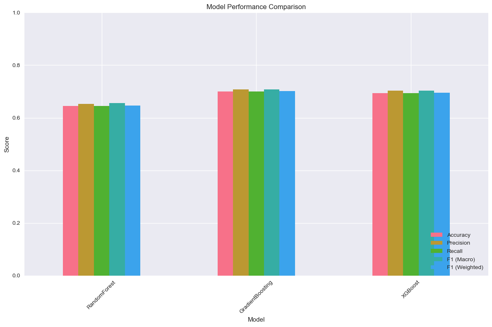
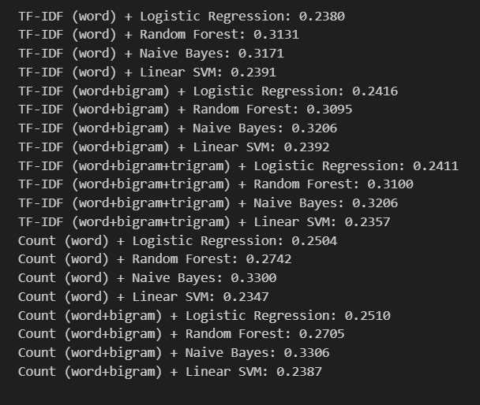
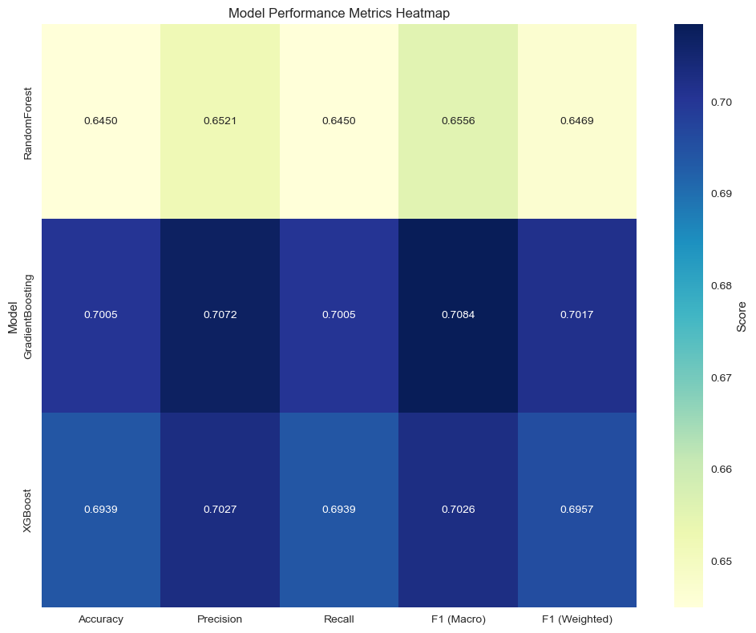

# Disaster Tweet Classification Project

## Overview

This project addresses the challenge of classifying tweets related to disasters. Social media, especially Twitter, is a vital source of real-time information during disasters. However, not every tweet mentioning disaster-related keywords actually pertains to a real disaster event. This project aims to automatically classify tweets into three categories:

Class 0: Disaster word used but no actual disaster occurred

Class 1: Disaster word used and disaster occurred

Class 2: Not disaster related

## Problem Statement

Many tweets contain disaster-related keywords but do not necessarily indicate an ongoing disaster event. Distinguishing between genuine disaster-related tweets and irrelevant or sarcastic ones can improve disaster response and situational awareness. This project tackles this classification problem to assist emergency responders, news agencies, and the public in filtering valuable information quickly and accurately.

## Background & Literature Review

Previous studies in disaster tweet classification mostly focus on keyword matching or sentiment analysis but struggle with sarcasm and context detection.

We explored various NLP feature extraction methods such as TF-IDF, word bi-grams, and tri-grams.

We also experimented with word embeddings like GloVe and Word2Vec to capture semantic nuances in tweets.

Several classification models such as Logistic Regression, Random Forest, Gradient Boosting, and XGBoost were evaluated.

The best performing model was Gradient Boosting trained on a combination of TF-IDF features and embedding-based sentiment features.

## Data

Training Data: combinedSarcasmDataset.csv (7563 samples)

Test Data: disasterTest.csv (3263 samples)

Sentiment Data: sentimentAnalysis.csv (40,000 samples)

Label distribution in training data:

## Methodology

### Step 1: Data Preprocessing

Text cleaning and normalization

Extraction of rich text features (e.g., length, punctuation, capitalization)

Sentiment extraction using GloVe embeddings and a sentiment analysis model

### Step 2: Feature Engineering

TF-IDF vectors with unigrams, bigrams, and trigrams

Sentiment features extracted via word embeddings

Categorical features and other rich text features combined

### Step 3: Model Training & Evaluation

Cross-validation on multiple models:

Random Forest

Gradient Boosting (best performer)

XGBoost

Gradient Boosting achieved the highest accuracy (~70%) and F1-score.

The final model saved as .pkl file for inference.

## Results

The Gradient Boosting model achieved:

Accuracy: 70.05% ± 1.29%

Precision: 70.72% ± 1.32%

Recall: 70.05% ± 1.29%

F1 Macro: 70.84% ± 1.27%

Prediction distribution on test data:

Class 0: 45.72%

Class 1: 21.48%

Class 2: 32.79%

### Sample prediction output for tweets includes probabilities for all three classes and the final predicted class with the highest probability.

## How to Use

### Running the Dashboard

A Streamlit dashboard is provided to interactively test tweet classification.

bash

CopyEdit

python -m streamlit run dashboardFifteen.py

Upload the trained model .pkl file through the dashboard.

Enter a tweet, and the dashboard returns:

Probability scores for each class

The predicted class label

### Code Structure

Data Loading & Preprocessing: Scripts to load datasets, clean text, extract features

Embedding Models: Loading GloVe and Word2Vec embeddings

Model Training: Training and cross-validation of multiple classifiers

Model Saving: Best model saved as .pkl file

Prediction Scripts: Functions to predict class for new tweets using the saved model

Dashboard: dashboardFifteen.py runs the Streamlit app for interactive prediction

## Future Work

Improve sentiment analysis accuracy

Incorporate transformer-based language models like BERT for better context understanding

Expand dataset with more labeled samples, including more sarcasm examples

Enhance dashboard UI/UX for easier model upload and visualization

## Acknowledgements

Datasets from Kaggle

GloVe and Word2Vec embedding providers

Open-source Python libraries used: scikit-learn, XGBoost, Streamlit, NLTK, pandas, numpy

## Visualizations

### Model Performance Comparison (Bar Chart)

### Feature Combination Results (Text Output Screenshot)

### Model Performance Metrics (Heatmap)
